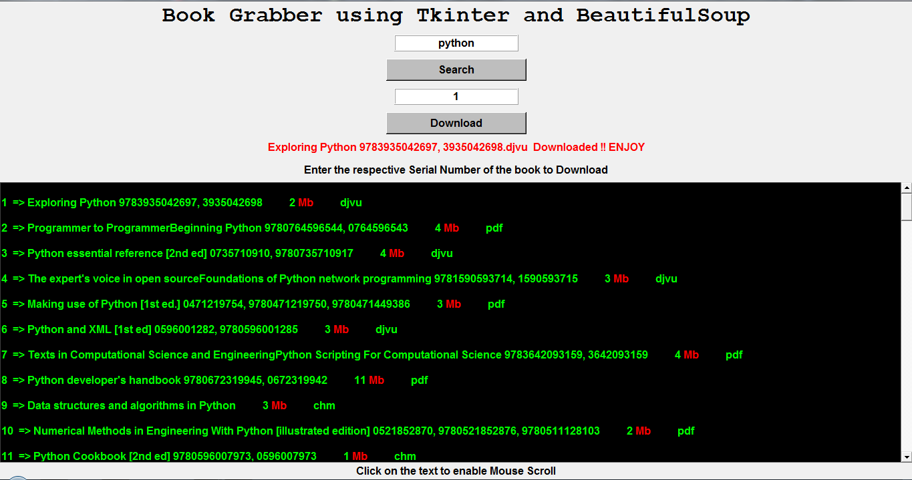
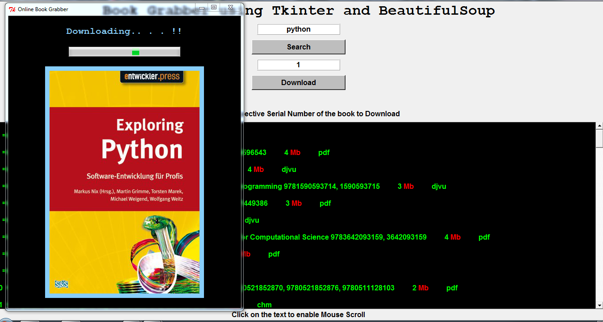

# Online Book Grabber  

### GUI Based Book Downloader using Tkinter and BeautifulSoup
  

  
****

Online Book Grabber lets You See a list of available book titles according to your search and also gives you an option to download it at the same time.

Books are being distributed through the largest online open library

http://gen.lib.rus.ec

### Requirements :  
  
* Python 2.7
 * pip install bs4 
  
* An Internet Connection

Diving in some techical details now...  
This piece of awesomeness uses BeautifulSoup to scrap all the top 100 table entries from the library's website.    

Also I managed to learn tkinter over the weekend and gave it its own handsomeness...

It not only downloads PDFs but it also downloads books in a variety of extensions such as djvu, epub, chm, etc.  
But observing that the famous browser Chrome can easily open PDFs, I decided to open them  directly after downloading for the lazy user.

Following are some of its screenshots :  

Some Console Based Output  
But Handy and more importantly Neat !!    

  
  
Also Previews you the Book Cover Page you have selected to download
  

